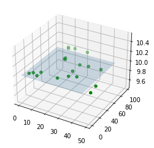
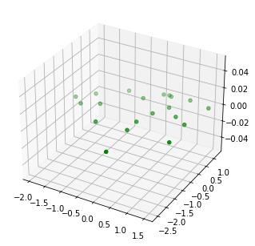
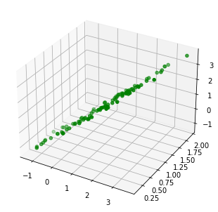
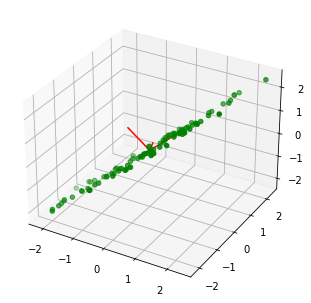
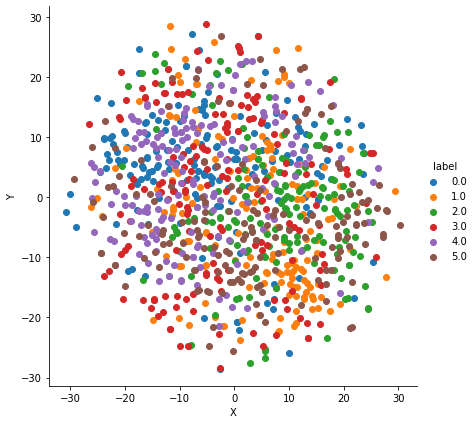
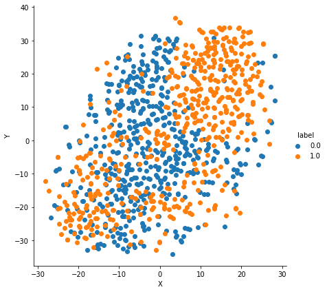
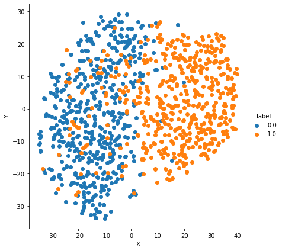
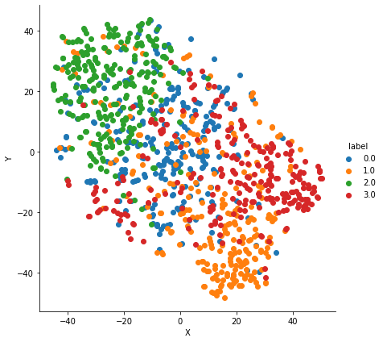

---
title:	"I barely know PCA and t-SNE"
date: 2021-09-22
---

  Emphasis on *barely.* My goal here is primarily to develop some understanding of what these are by *seeing* what they do. The goal of documenting the journey is to provide a breadcrumb trail of sorts for me to follow in the future when I forget what these are and what they do. Keep in mind that I’m not an expert of this subject matter (but I link to those who are).

## How’d I get here?

I’m embarking on a slightly larger project to find similar climate locales by clustering geospatial climate data. In both [the paper on a modern Köppen-Geiger map](http://www.gloh2o.org/koppen/) and [the paper from ArcGis’s world climate regions](https://storymaps.arcgis.com/stories/61a5d4e9494f46c2b520a984b2398f3b), PCA is discussed as an obvious first step before clustering geospatial data.

## What does PCA do?

Scikit-Learn’s (SKLearn) [documentation](https://scikit-learn.org/stable/modules/generated/sklearn.decomposition.PCA.html) is fantastic at unblocking me if I just need the code to be unblocked:

```python
import numpy as np  
from sklearn.decomposition import PCA  
X = np.array([[-1, -1], [-2, -1], [-3, -2], [1, 1], [2, 1], [3, 2]])  
pca = PCA(n_components=2)  
pca.fit(X)  
PCA(n_components=2)  
print(pca.explained_variance_ratio_)  
[0.9924... 0.0075...]  
print(pca.singular_values_)  
[6.30061... 0.54980...]
```

Unfortunately, I need a bit more. [Dr Ravi Kalia’s series](https://medium.com/@ravikalia/what-is-principal-components-analysis-a92b939951e5) provides a wonderful overview of PCA. In my own words, Principal Component Analysis strives to preserve the full variance of a dataset but with reduced dimensionality. The result of PCA is eigenvectors describing a change of basis on the dataset. Before I embarrass myself by trying describe something I know next to nothing about, I need to try a bit of it.

## Messing around with PCA

First, I just want to prove that PCA does what it says it does. The hypothesis here being that if I give some set of data with a useless dimension, PCA should be able to identify that the useless dimension provides little variance. I’m not entirely sure what a “useless” dimension is here, but I have two guesses: (1) an independent features of the dataset that is constant and (2) a duplicate feature. 

## PCA Round 1

```python
import numpy as np  
from sklearn.decomposition import PCA  
import random  
import matplotlib.pyplot as plt  
from mpl_toolkits.mplot3d import Axes3D

#%% Dataset with a constant dimension on Z  
N = 20  
X = [random.randint(1, 50) for _ in range(N)]  
Y = [random.randint(1, 100) for _ in range(N)]  
Z = 10 # This is just a plane on the z constant  

xplane, yplane = np.meshgrid(range(0, 50, 5), range(0, 100, 10))  
zplane = np.array([[Z for _ in range(10)] for _ in range(10)])
ax = Axes3D(plt.figure()  
ax.scatter3D(X, Y, Z, c='Green')  
ax.plot_surface(xplane, yplane, zplane, alpha=0.2)
M = np.array(list(zip(X, Y, [Z] * len(Y))))  
pca = PCA(n_components=3)  
pca.fit(M)

print(pca.explained_variance_ratio_)  
print(pca.components_)
```

I created a dataset by hand with a constant Z (useless feature in the dataset). I graph the data and then run PCA from SKLearn on it. 


Plot of round 1 dataset

```python
# explained variance ratio for each feature  
[0.84695375 0.15304625 0. ]   
# eigenvectors  
[[-0.09800977 0.99518545 0. ]   
 [ 0.99518545 0.09800977 0. ]   
 [ 0. 0. 1. ]]
```

Well Z is indeed useless. That’s good news, but I learned a few things in doing this:
* I don’t need to handroll example datasets ([See make_collection from SKLearn](https://scikit-learn.org/stable/modules/generated/sklearn.datasets.make_classification.html))
* PCA doesn’t center or scale your features for you and that’s important.

## PCA Round 1 v2

```python
N = 20  
X = [random.randint(1, 50) for _ in range(N)]  
Y = [random.randint(1, 100) for _ in range(N)]  
Z = [10] * N  
M = scale(list(zip(X, Y, Z)))

fig = plt.figure()  
ax = Axes3D(fig)  
fig.add_axes(ax)  
ax.scatter3D(M[:,0], M[:,1], M[:,2], c='Green')

pca = PCA(n_components=3)  
pca.fit(M)  
print(pca.explained_variance_ratio_)  
print(pca.components_)
```

So now I’m calling [scale()](https://scikit-learn.org/stable/modules/generated/sklearn.preprocessing.scale.html) to [mean-center and scale the features](https://medium.com/@ravikalia/simple-pca-implementations-7edb130fb01b) which definitely changes things and it seems more accurate? I feel like this could also be due to the random distribution of the samples I’m creating. Either way, normalizing the data intuitively makes sense to me.



```python
# explained variance ratio split between X and Y  
[0.56490075 0.43509925 0. ]   
# eigenvectors  
[[ 0.70710678 0.70710678 0. ]   
 [ 0.70710678 -0.70710678 -0. ]   
 [ 0. 0. 1. ]]
```

## PCA Round 2

Alright, so clearly a constant is useless information and PCA will identify that even if I don’t preprocess the samples correctly. In Round 2 I’m going to try a redundant feature. A redundant feature in my mind is a feature that’s fully dependent on another feature. Also going to use [make_classification()](https://scikit-learn.org/stable/modules/generated/sklearn.datasets.make_classification.html) to create the dataset. 

```python
M, _ = make_classification(
  n_samples=100, 
  n_classes=1, 
  n_clusters_per_class=1, 
  n_features=3, 
  n_informative=2, 
  n_redundant=0, 
  n_repeated=1
)  
M = scale(M)
fig = plt.figure()  

ax = Axes3D(fig, auto_add_to_figure=False)  
fig.add_axes(ax)  
ax.scatter3D(M[:,0], M[:,1], M[:,2], c='Green')

pca = PCA(n_components=3)  
pca.fit(M)  
print(pca.explained_variance_ratio_)  
print(pca.components_)  
```


Uncentered/scaled dataset from make_classification

```python
# resulting variance ratios and eigenvectors  
[9.25789144e-01 7.42108561e-02 7.20317664e-33]   
[[ 0.58979447 0.55162032 0.58979447]   
 [-0.39005447 0.83409533 -0.39005447]   
 [-0.70710678 0. 0.70710678]]  
```


Adding the eigenvectors to the scaled and centered dataset

## PCA Summary

Alright, I wasn’t hoping to reach a deep mathematical understanding of what I’m doing here, just a cursory understanding of how to use PCA and what it does. It clearly identifies the features with variance in the dataset when I create datasets with meaningless or redundant features. Cool that’s useful.

I don’t however, pretend to know the ins and outs of variance/covariance nor do I remember much of my linear maths course from college. 

**More stuff to read on PCA:**

* If you want more math detail and code on PCA, I highly recommend the [implementations of PCA from Dr. Ravi Kalia using multiple frameworks (with tests!).](https://medium.com/@ravikalia/pca-done-from-scratch-with-python-2b5eb2790bfc)
* If you want to keep going with all things ‘eigen,’ then I highly recommend [Duke’s set of notes.](https://people.duke.edu/~ccc14/sta-663/PCASolutions.html)
* If you want PCA as a real world application, there are tons of medium posts out there using it, but my favorite is the [series in Python Data Science Handbook](https://jakevdp.github.io/PythonDataScienceHandbook/05.09-principal-component-analysis.html).
* Lastly, the[ documentation page on SKLearn](https://scikit-learn.org/stable/modules/generated/sklearn.decomposition.PCA.html) has a wealth of options, implementations, and links to research papers.
### t-SNE

Now, I actually have no idea what this is. Unfortunately the full name, t-distributed stochastic neighbor embedding, doesn’t help much either. Have a look at[ the wikipedia page](https://en.wikipedia.org/wiki/T-distributed_stochastic_neighbor_embedding). It kind of helps? High dimensional to low dimensional being the theme here.

## How’d I get here?

In learning about PCA, I routinely stumbled on data science blog posts that would compare them. The comparison, however, was mostly around visualizing data rather than as a preprocessing for analysis. It seems that PCA was also used to take highly dimensional data and reduce those dimensions for visualization. In this way it seems that PCA does not offer great visualizations but t-SNE does. t-SNE is included in SKLearn so I might as well dabble around with that too.

## Messing around with t-SNE

I’m going to generate a clustered dataset with alot of features, then use PCA to filter the noise, and finally visualize my data with t-SNE.

```python
import numpy as np  
import pandas as pd  
import matplotlib.pyplot as pltfrom sklearn.preprocessing import scale  
from sklearn.datasets import make_classification  
from sklearn.decomposition import PCA  
from sklearn.manifold import TSNEfrom seaborn import FacetGrid

#%% Dataset  
M, labels = make_classification(  
 n_samples=1000,  
 n_classes=6,  
 n_clusters_per_class=2,  
 n_features=100,  
 n_informative=10,  
 n_redundant=10,  
 n_repeated=10  
)  
M = scale(M)

#%% I want 90% of the variance  
pca = PCA(n_components=0.9, svd_solver='full')  
pca.fit(M)  
print(len(pca.explained_variance_ratio_))  
reduced_M = pca.transform(M)
tsne_data = TSNE().fit_transform(reduced_M)

with plt.ioff():  
  tsne_data = np.hstack((tsne_data, np.split(labels, len(labels))))  
  tsne_df = pd.DataFrame(data=tsne_data, columns=('X', 'Y', 'label'))  
  FacetGrid(tsne_df, hue='label', height=6).map(plt.scatter, 'X', 'Y').add_legend()  
  plt.show()  
```


Not really seeing the clusters here

At first attempt, this seems quite disappointing. Colors aside, there isn’t much clustering of data happening here. I think the seed data from make_classification might be the issue here? Maybe it’s too random?

```python
M, labels = make_classification(  
 n_samples=1000,  
 n_classes=2,  
 n_clusters_per_class=1,  
 n_features=20,  
 n_informative=2,  
 n_redundant=2,  
 n_repeated=2  
)
```

Adjusting the parameters for the classification dataset didn’t improve clustering much.



After repeated attempts of increasing the PCA filter and reducing noise in the dataset’s initialization, I reached something that looks like clustering, though only with colored labels.



A final attempt with more tuning and more classes in the dataset.

```python
M, labels = make_classification(  
 n_samples=1000,  
 n_classes=4,  
 n_clusters_per_class=1,  
 n_features=20,  
 n_informative=4,  
 n_redundant=2,  
 n_repeated=0  
)  
M = scale(M)pca = PCA(n_components=0.5, svd_solver='full')  
pca.fit(M)  
print(len(pca.explained_variance_ratio_))  
reduced_M = pca.transform(M)
model = TSNE(perplexity=20, learning_rate=250, square_distances=True)  
model_data = model.fit_transform(reduced_M)  
```

Enough for now.

  